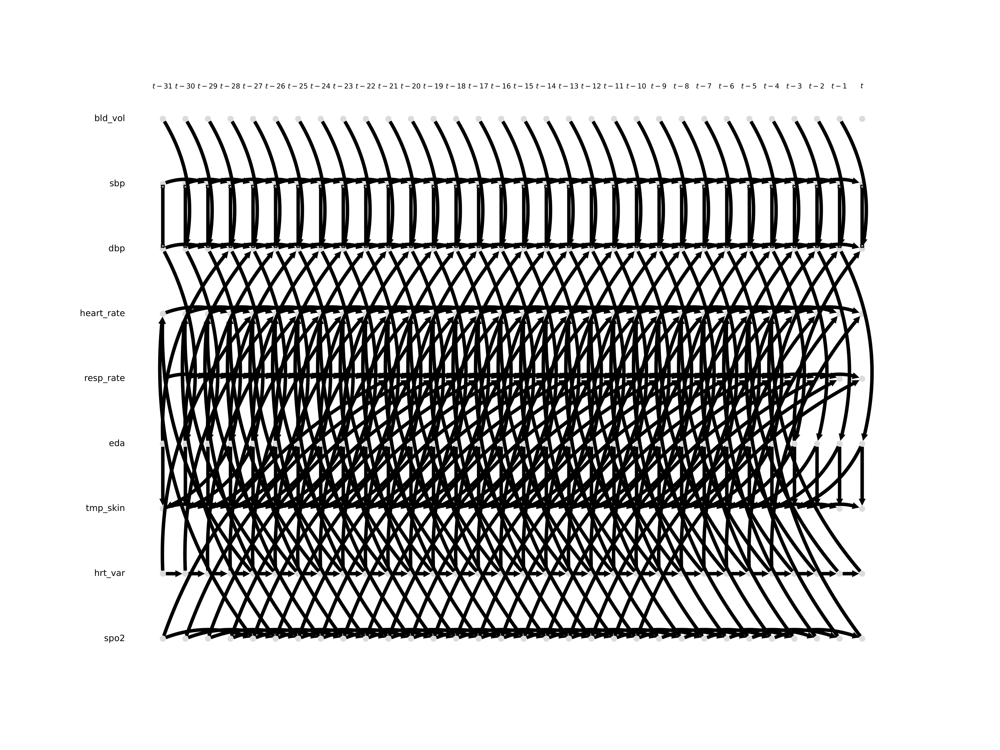
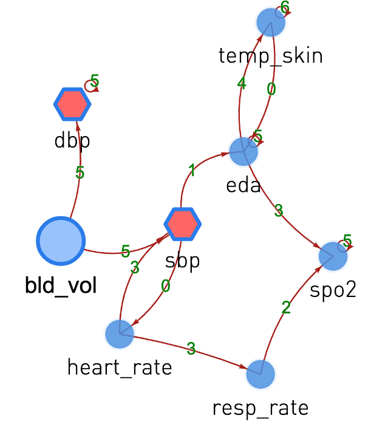
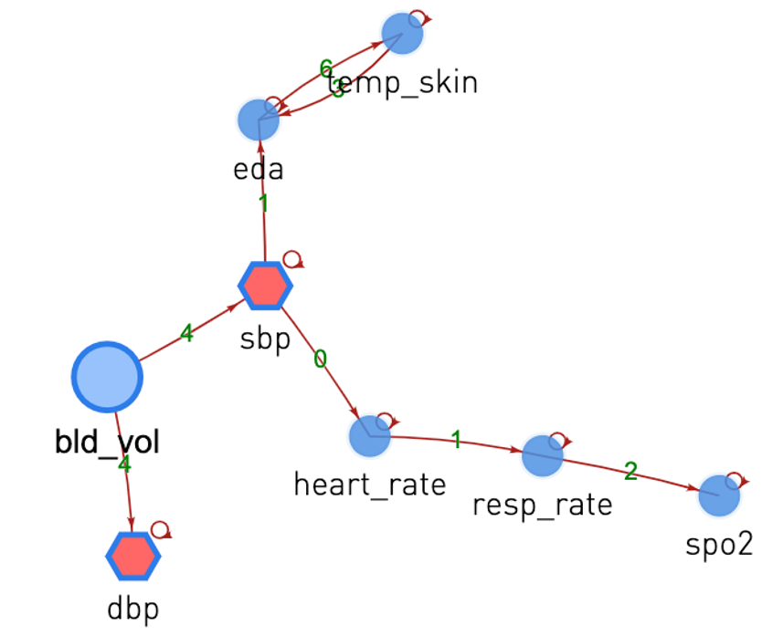

# binlan-wu-master-thesis

## Dynamic Causal Discovery

## Installation

(1) Create your Virtual Environment

<pre>
conda create -n shape_correspondence
conda activate shape_correspondence
</pre>

(2) Install requirements

<pre>
pip install -r requirements.txt
</pre>

## Dynamic Causal Discovery
PCMCI
[\[repo\]](https://github.com/pvnieo/DPFM) [\[paper\]](http://www.lix.polytechnique.fr/~maks/papers/DPFM_3DV2021.pdf) 

PCMCI+
[\[repo\]](https://github.com/pvnieo/DPFM) [\[paper\]](http://www.lix.polytechnique.fr/~maks/papers/DPFM_3DV2021.pdf) 

LPCMCI
[\[repo\]](https://github.com/pvnieo/DPFM) [\[paper\]](http://www.lix.polytechnique.fr/~maks/papers/DPFM_3DV2021.pdf) 

Dynotears
[\[repo\]](https://github.com/quantumblacklabs/causalnex/blob/develop/causalnex/structure/dynotears.py) [\[paper\]](http://www.lix.polytechnique.fr/~maks/papers/DPFM_3DV2021.pdf)

## Data

We used two data sources. You can find the syntehtic data set perturbation and creation from [glocal graph generation](https://github.com/ichbinlan99/binlan-wu-master-thesis/blob/main/synthetic_data/data_generator_no_act.py) and [perturbation](https://github.com/SCAI-Lab/dyn_graph_syn/tree/adapted)

|  Data | Location  |
|---|---|
|  Synthetic Global |  https://github.com/ichbinlan99/binlan-wu-master-thesis/blob/main/synthetic_data/data_generator_no_act.py |
|  Synthetic Perturbation | https://github.com/SCAI-Lab/dyn_graph_syn/tree/adapted  |
| Urodynamics | not public available |

Here's an exmaple of a perturbation sampler, a more detailed explaination can be find in the thesis

Implementation of the graph aggregation can be find in [\[graph_pert\]]([https://github.com/pvnieo/DPFM](https://github.com/ichbinlan99/binlan-wu-master-thesis/tree/graph_pert))

The results from the models are saved in:
    
    out/.
    
One can learn and validate the above models with notebooks in the following section 

## Notebooks

We created several notebooks to showcase the models and to create figures seen in the report.

- [graph perturbation simulation_notebook](https://github.com/ichbinlan99/binlan-wu-master-thesis/blob/graph_pert/graph%20perturbation%20simulation.ipynb):\
randomly define the number of nodes and edges and generata a DAG. Perturbations are applied with predefined number of actions

- [synthetic causal discovery_notebook](https://github.com/ichbinlan99/binlan-wu-master-thesis/blob/synthetic/synthetic_data.ipynb):\
Overview of methods on synthetic data with perturbations 

- [real data causal discovery notebook](https://github.com/ichbinlan99/binlan-wu-master-thesis/blob/scai/scai-causal-discovery.ipynb):\
overview of methods on real data

- [causal effect estimation notebook](https://github.com/ichbinlan99/binlan-wu-master-thesis/blob/scai/causal%20effect%20estimation.ipynb):\
causal effect estimation using the global grap we ovtained in the end

- [data preprocessing notebook](https://github.com/ichbinlan99/binlan-wu-master-thesis/blob/scai/data%20processing.ipynb):\
overview of the data processing step

## Acknowledgements

A special thanks to Diego, Yanke, and Hoijan for their helpful discussions and comments.

